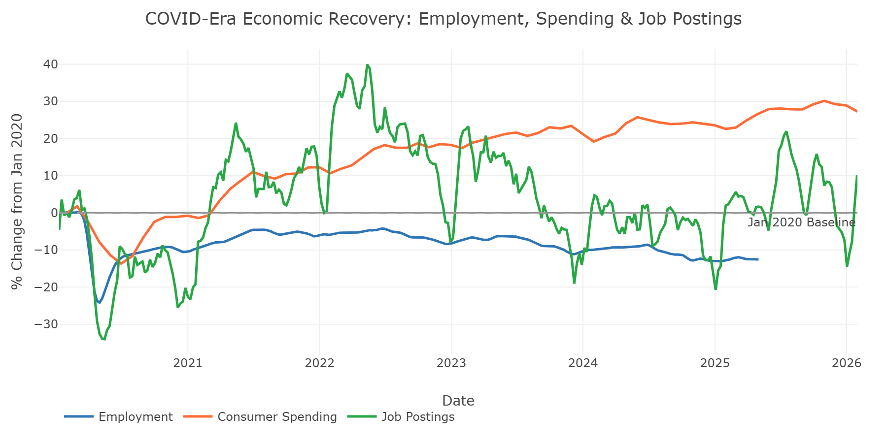

# Economic Tracker Dashboard

## Problem Statement

The COVID-19 pandemic caused unprecedented disruption to the U.S. economy beginning in March 2020. Employment collapsed, consumer spending plummeted, unemployment claims spiked to historic levels, and student learning was upended overnight. Five years later, recovery has been uneven across income groups, geographies, and sectors.

This dashboard visualizes county-level economic recovery using data from the [Opportunity Insights Economic Tracker](https://github.com/OpportunityInsights/EconomicTracker), making it easy to explore how different parts of the country have recovered across five key indicators: employment, consumer spending, job postings, unemployment insurance claims, and student progress.

## Live App

[Streamlit App](https://economics-tracker-ktkerofyvkwgrkxhz5wiua.streamlit.app/)

## Key Findings



The recovery from COVID has been strikingly uneven across economic indicators:

- **Consumer spending has fully recovered and then some**, running roughly +25% above January 2020 levels as of early 2026. Stimulus payments, pent-up demand, and inflation all contributed to sustained card spending growth.
- **Job postings recovered quickly** and currently sit about +5% above pre-pandemic levels, suggesting labor demand remains healthy.
- **Employment has not recovered** and remains about -13% below its January 2020 baseline. This is the starkest finding: spending and hiring demand bounced back, but actual payroll employment (as measured by Paychex/Intuit data) has not returned to pre-pandemic levels.


The wage-quartile breakdown reveals the K-shaped nature of the recovery:

- **Top-quartile workers** experienced a shallower employment drop and a faster partial recovery.
- **Bottom-quartile workers** saw the deepest employment losses and the slowest recovery, consistently trailing the overall average.
- **Unemployment insurance claims** spiked to 3.73 initial claims per 100 workers at the pandemic peak, but have since normalized to around 0.15 per 100 workers.

## How to Replicate

### Prerequisites

- Python 3.10+

### Steps

```bash
git clone https://github.com/monacosc1/economics-tracker.git
cd economics-tracker
pip install -r requirements.txt
streamlit run app.py
```

Open http://localhost:8501 in your browser. The first page load takes 5-15 seconds to fetch data from GitHub; subsequent loads are instant (cached for 24 hours).

### Project Structure

```
economics-tracker/
  app.py                         # Landing page with national summary
  .streamlit/config.toml         # Theme configuration
  src/
    config.py                    # Dataset configs, column mappings, URLs
    data_loader.py               # @st.cache_data fetch + transform pipeline
    charts.py                    # Plotly time-series chart builders
    maps.py                      # Plotly scatter_mapbox map builders
    page_builder.py              # Generic page rendering function (DRY)
  pages/
    1_Spending.py                # Each page is ~5 lines calling page_builder
    2_Employment.py
    3_Job_Postings.py
    4_Unemployment.py
    5_Student_Progress.py
  data/
    us_county_latlng.csv         # County coordinates (3,140 counties, 120KB)
  charts/                        # README images
  requirements.txt               # streamlit, pandas, plotly, requests
```

## Datasets

| Dataset | Source | Frequency | Metrics |
|---------|--------|-----------|---------|
| Consumer Spending | Affinity Solutions | Monthly | Total spending (seasonally adjusted and unadjusted) |
| Employment | Paychex, Intuit | Weekly | Overall + by wage quartile (7 metrics) |
| Job Postings | Lightcast (Burning Glass) | Weekly | All postings + by preparation level (3 metrics) |
| Unemployment Claims | Dept. of Labor | Weekly | Initial claims count and rate |
| Student Progress | Zearn | Weekly | Student engagement and badges earned |

All metrics (except UI claims) represent percentage change from a January 2020 pre-COVID baseline.

## Steps to Update

This dashboard fetches data at runtime from the Opportunity Insights GitHub repository, so **the data updates automatically** without any action needed. Cached data refreshes every 24 hours.

If you need to make changes to the dashboard itself:

### Adding a new dataset

1. Add the CSV URL to `DATA_URLS` in `src/config.py`
2. Add a dataset entry to `DATASETS` with title, icon, description, date columns, metrics, and source
3. Create a new page file in `pages/` (5 lines — copy any existing page and change the key)

### Updating county coordinates

If new counties are added or FIPS codes change, regenerate `data/us_county_latlng.csv`:

```python
import pandas as pd

counties = pd.read_csv("https://raw.githubusercontent.com/OpportunityInsights/EconomicTracker/main/data/GeoIDs%20-%20County.csv")
coords = pd.read_csv("https://raw.githubusercontent.com/btskinner/spatial/master/data/county_centers.csv")

counties = counties.rename(columns={"countyname": "county_name", "stateabbrev": "state"})
coords = coords.rename(columns={"fips": "countyfips", "pclon10": "lng", "pclat10": "lat"})

merged = counties[["countyfips", "county_name", "state"]].merge(
    coords[["countyfips", "lat", "lng"]], on="countyfips", how="inner"
)
merged["lat"] = merged["lat"].round(6)
merged["lng"] = merged["lng"].round(6)
merged.to_csv("data/us_county_latlng.csv", index=False)
```

### Deploying to Streamlit Cloud

Push to GitHub and connect the repo to [Streamlit Cloud](https://streamlit.io/cloud). Set `app.py` as the main file. No secrets or environment variables are needed.

## View Full Analysis

For the complete writeup with all charts and methodology, visit the [project page on scottmonaco.com](https://scottmonaco.com/economic-tracker).
