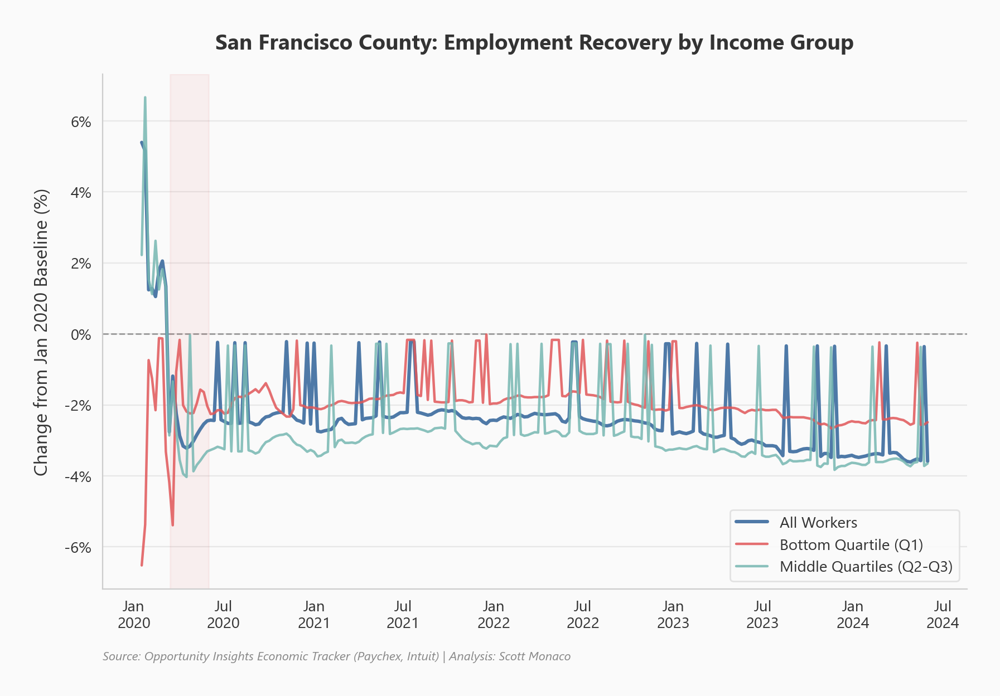

# Economic Tracker Dashboard

Streamlit dashboard tracking COVID-era economic recovery using Opportunity Insights data for employment, spending, and unemployment claims across U.S. counties.

## Key Finding

*San Francisco employment levels relative to pre-pandemic baseline, illustrating the prolonged recovery gap in major tech-hub metros.*

## Overview

The COVID-19 pandemic caused an unprecedented economic disruption, but recovery has been far from uniform across U.S. metros. This dashboard leverages the Opportunity Insights Economic Tracker dataset to visualize employment rates, consumer spending patterns, and unemployment claims at the county level. Interactive filters allow users to compare recovery trajectories across regions, industries, and income groups to understand which areas bounced back quickly and which continue to lag.

## Tools & Technologies

- Python
- Pandas
- Streamlit
- Matplotlib
- Seaborn

## Results

Employment recovery has been highly uneven across metros, with San Francisco still trailing pre-pandemic levels years after the initial shock. Consumer spending patterns tell a different story, with some Sun Belt metros showing strong rebounds:

*Miami-area consumer spending recovery, showing a faster rebound compared to many coastal tech-hub metros.*

## View Full Analysis

For the complete writeup with all charts and methodology, visit the [project page on scottmonaco.com](https://scottmonaco.com/economic-tracker).
